# GoodFood

- Guia detallada
  - [Descripción de la aplicación](https://github.com/avilrod3004/Proyecto4_GoodFood/tree/4_2_firestorage?tab=readme-ov-file#descripci%C3%B3n-de-la-aplicaci%C3%B3n)
  - Tecnologías utilizadas
  - Instalación y configuración
- Documentación del código
- Reflexión
- Versión desplegada

# Guía detallada
## Descripción de la aplicación
GoodFood es una aplicación web SPA diseñada para facilitar la búsqueda de recetas.  Su propósito es ayudar a los usuarios a innovar en la cocina, permitiéndoles descubrir nuevas recetas de diferentes características y culturas.

## Pantallas y funcionalidades
1. **Pantalla de inicio**: Da la bienvenida al usuario y lo invita a descubrir nuevas recetas. Un poco más abajo de la portada se muestran 20 recetas aletorias paginadas.
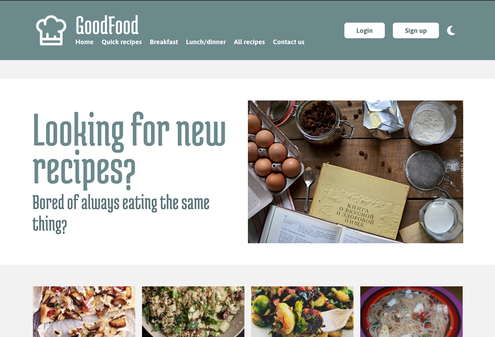
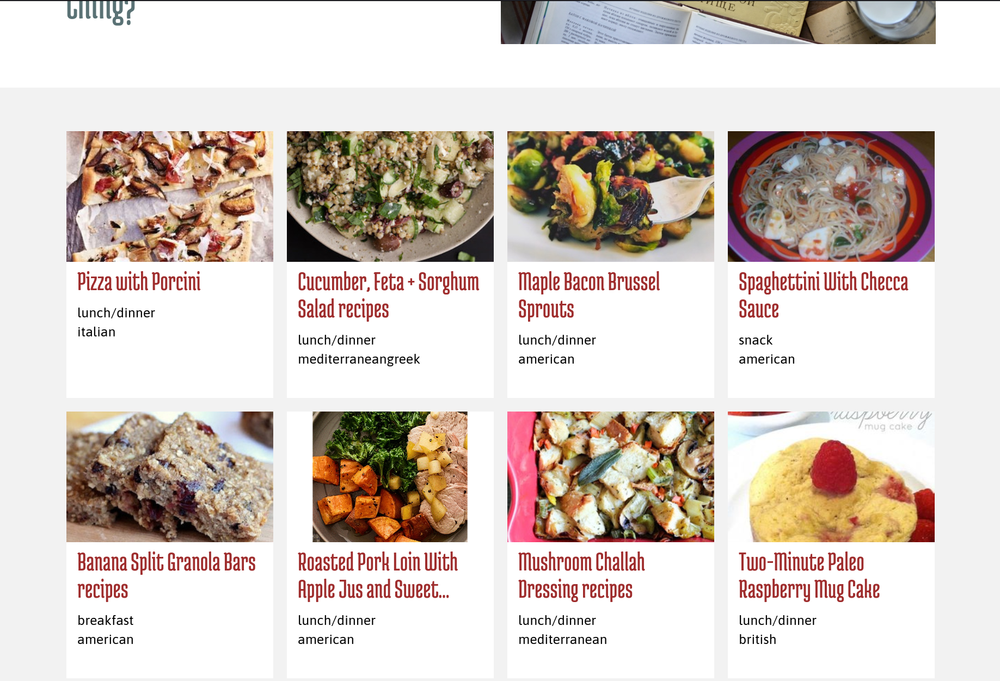

2. **Pantallas de inicio de sesión y de registro**: Estas páginas son accesibles desde el encabezado de la web. Permiten a usurio crear una cuenta o iniciar sesión si ya tiene una cuenta.
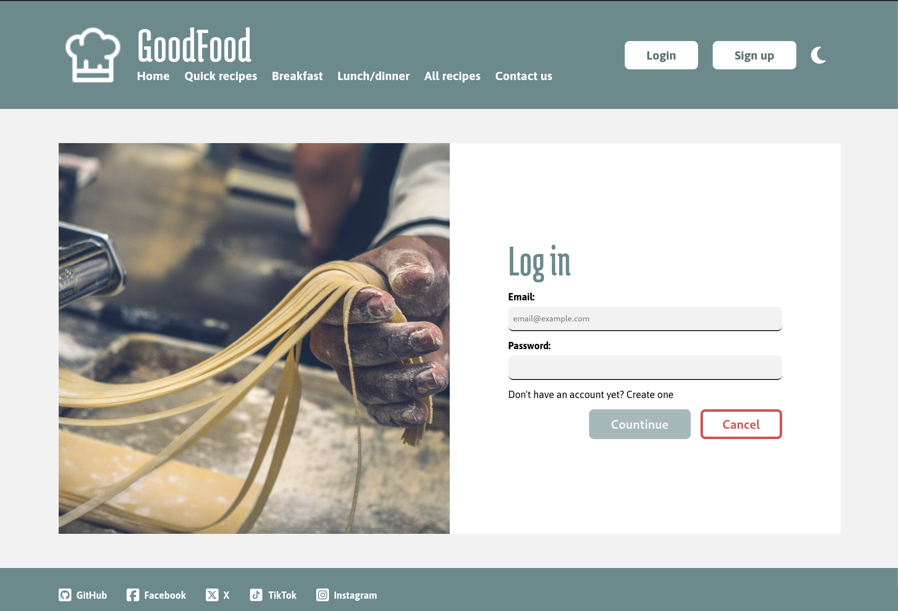
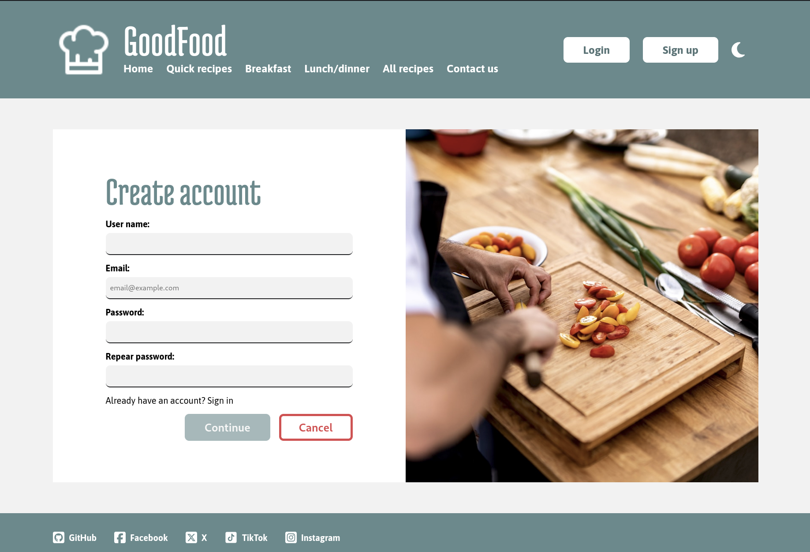

3. **Perfil del usuario**: Después de entrar en su cuenta el usuario es dirigido a su perfil. Desde esta pantalla puede añadir información a su perfil, como: biografiá y enlaces a sus redes sociales, etc. También puede consultar sus recetas guardadas en favoritos. Las recetas se pueden visualizar en dos formatos: tarjetas pequeñas y tarjetas grandes (contienen más información).
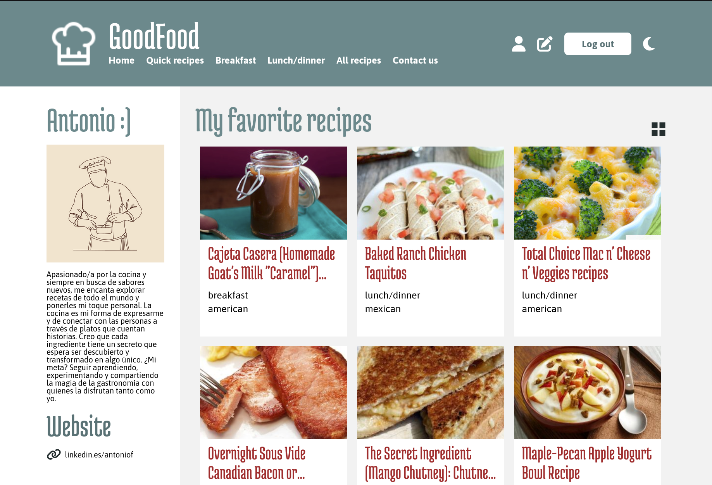
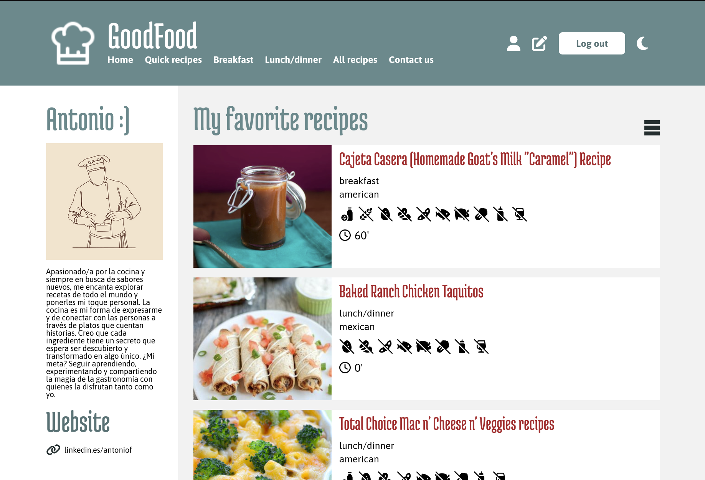

4. **Actualizar los datos del usuario**: Desde el encabezado de la página el usuario puede modificar la información que se muestra en su perfil, como: su nombre de usuario, su biografiá, enlaces de sus redes sociales. Y también la información privada del usuario, como: su nombre y apellido, y su número de teléfono. 
De los datos públicos son obligatorios: el nombre del usuario y la biografía. La información que se muestra en el perfil dependerá los campos que haya rellenado.
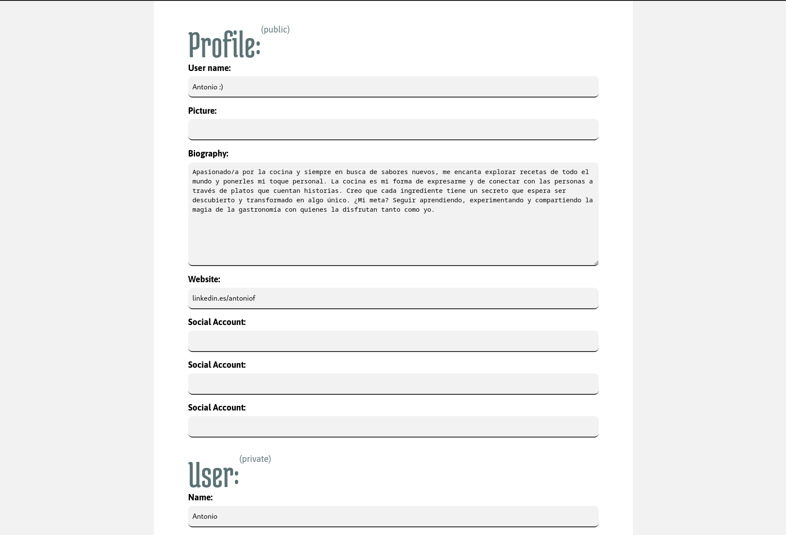

5. **Buscar recetas por filtros** (solo para usuarios registrados): Hay 4 pantallas que permiten buscar recetas aplicando filtros: "Quick recipes", "Breakfast", "Lunch/dinner" y "All recipes". Las 3 primeras tienen aplicados unos filtros predeterminados y la última no tiene ningun filtro por defecto.
Todas las busquedas estan paginadas en grupos de 20 recetas por página.
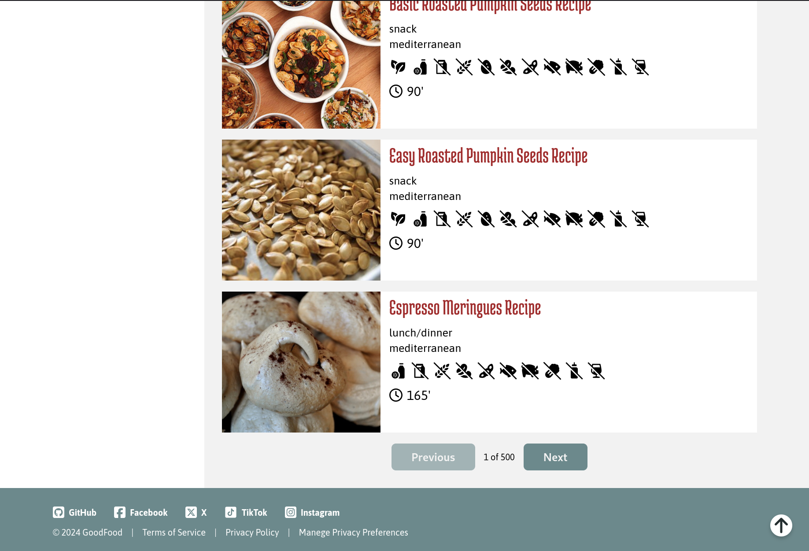

   - **Quick recipes**: Muestra recetas que duran menos de 15 minutos. Aparte el usuario puede añadir más filtros a la busqueda.
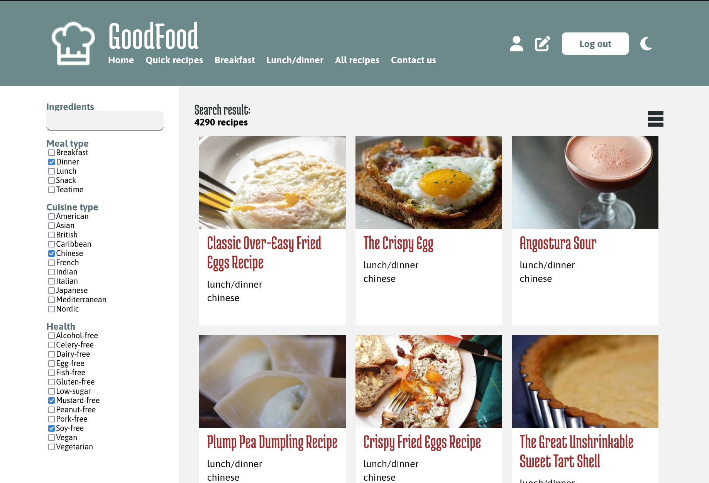
    - **Breakfast**: Muestra recetas de desayunos.
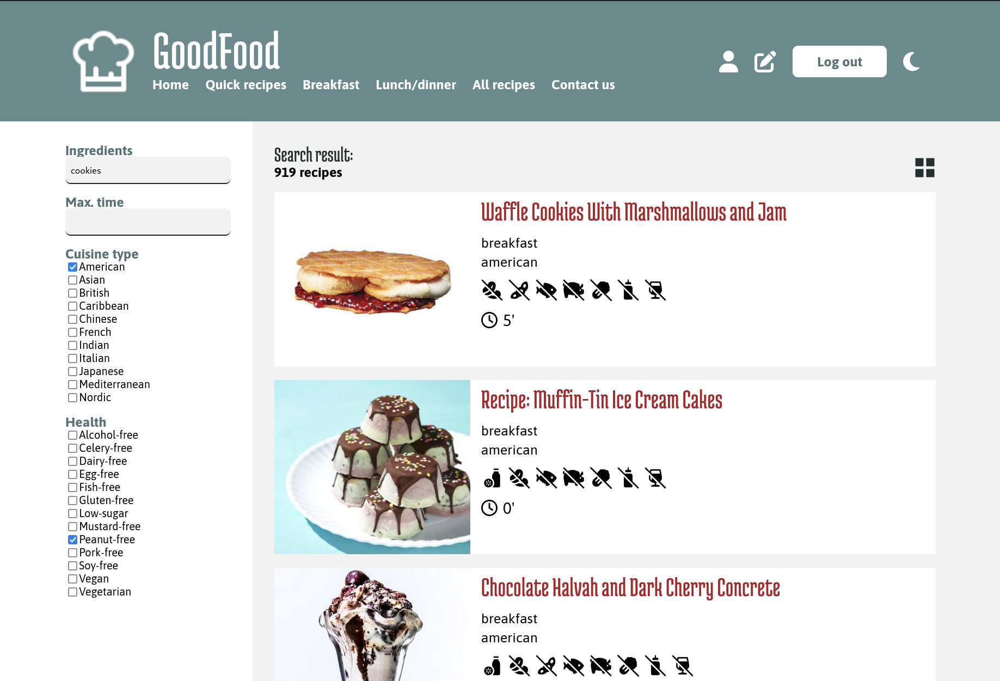
    - **Lunch/dinner**: Muestra recetas para la hora de comer o cenar.
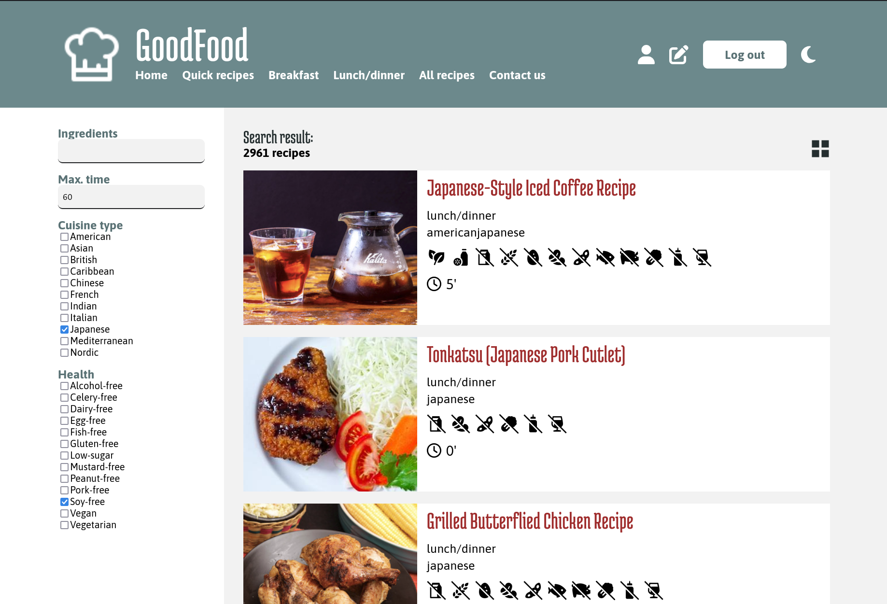
    - **All recipes**: No aplica filtros por defecto. La que muestre recetas el usuario debe aplicar como mínimo un filtro.
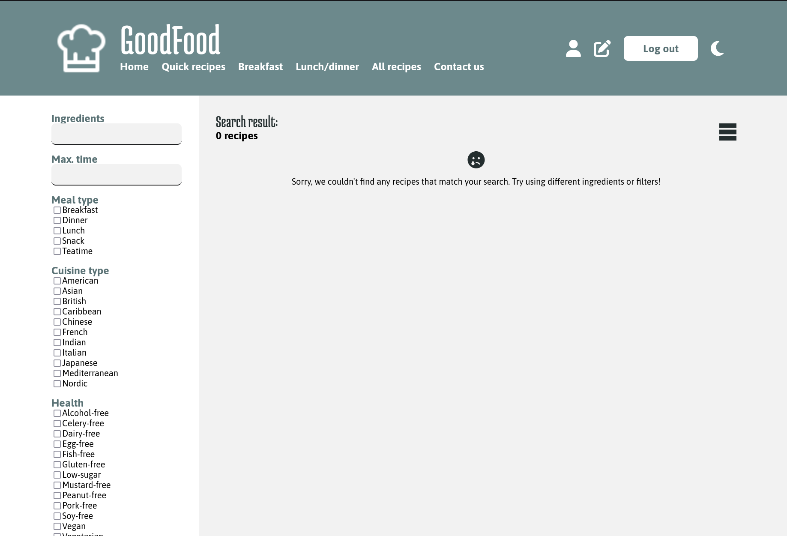
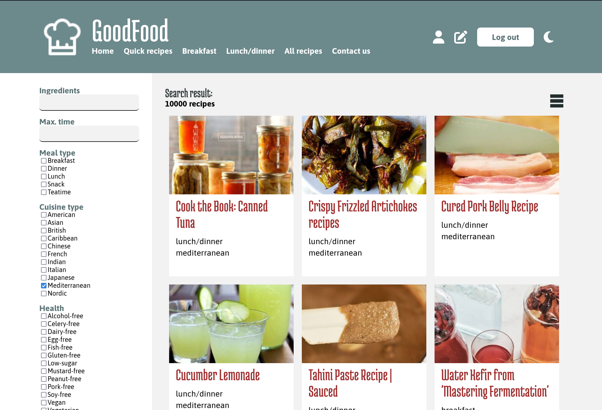

6. **Información de las recetas** (solo para usuarios registrados): Al pinchar en alguna de las recetas el usuario es redirigido a una página donde puede consultar más información sobre la receta. Desde esta pantalla el usuario puede agregar (o quitar) la receta a favoritos.
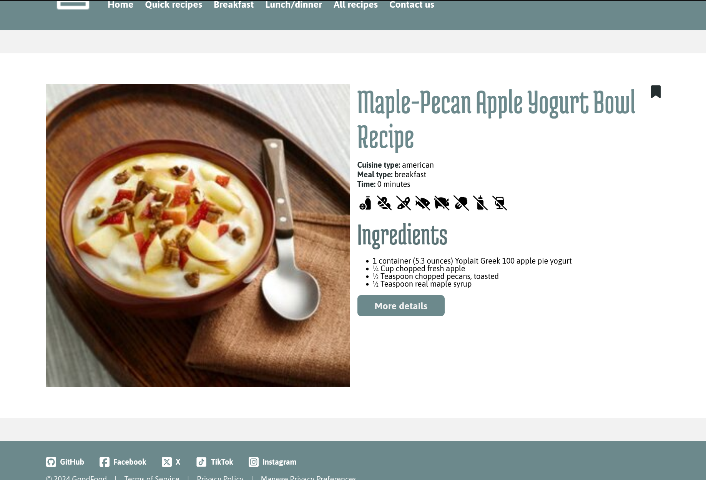

7. **Formulario de contacto**: La web ofrece un formulario de contacto para todos los usuarios:
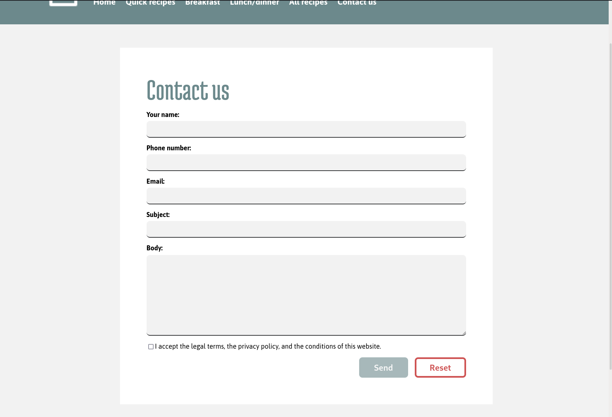

## Tecnologías utilizadas
-  -> Para la estructura básica de la aplicación web.
-   -> Para el diseño y los estilos
-  -> Librería basada en JavaScript para construir interfaces de usuario.
-  -> Para crear una web SPA.
-  -> Para usar toasts que informen al usuario según los eventos que suceden.
-  -> Para guardar los datos del usuario en el navegador mientras está usando la web.
-  -> Para gestionar los usuarios registrados.
-  -> Para almacenar de forma persistente los datos de los usuarios.
-  -> Herramienta para construir la estructura del proyecto
-  -> Sistema de control de versiones
-  -> Repositorio para alojar el código del proyecto.
-  -> IDE usado para desarrollar el proyecto.
-  -> API externa para obtener las recetas. Permite hacer consultas sobre más de 2 millones de recetas. [Edamam recipe API](https://developer.edamam.com/edamam-recipe-api)

## Instalación y configuración
1. Instalar node, comprobar si esta instalado con el comando `node --version`
2. Clonar el repositorio.
3. Abrir la carpeta del proyecto y ejecutar el comando `npm install` para instalar todas las dependencias.
4. Añadir las variables de entorno de firebase y de la API en un fichero `.env.local`, siguiendo esta estructura:
```
VITE_FIREBASE_API_KEY=""
VITE_FIREBASE_AUTH_DOMAIN=""
VITE_FIREBASE_PROJECT_ID=""
VITE_FIREBASE_STORAGE_BUCKET=""
VITE_FIREBASE_MESSAGING_SENDER_ID=""
VITE_FIREBASE_APP_ID=""
VITE_RECIPES_API_ID=""
VITE_RECIPES_API_KEY=""
```
5. Ejecutar el proyecto en local con este comando `npm run dev`.

# Documentación del código
aaa

# Reflexión

# Versión desplegada
[GoodFood desplegado de Netlify](fanciful-vacherin-2a3294.netlify.app/)
