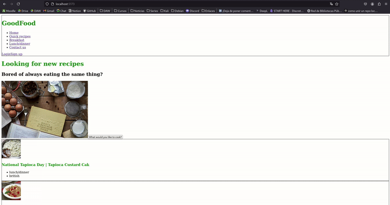

# GoodFood

## Tercera entrega. Integración y avance
### Progreso
Nuevas funcionalidades:
- **Inicio de sesión y registro**: Autenticación de usuarios mediante Firebase.
- **Protección de rutas**: Las rutas privadas (usan un layout privado) solo son accesibles si un usuario está logueado. En caso de que no este logueado al intentar acceder a las páginas privadas el usuario es redirigido al formulario de login.
- **LazyLoad**: Se cargan solo los componentes principales cuando el usuario accede a la web. Componentes que no se cargan: páginas de búsqueda de recetas, el perfil de usuario y la página de error 404.
- **Petición a la API**: Llamada a la API en la página de inicio. En la página `/home` se muestran 20 recetas aleatorias. Las recetas están paginadas en grupos de 10 recetas.

Objeto con los datos para hacer la petición:
https://github.com/avilrod3004/Proyecto4_GoodFood/blob/bc5f2a7bd4c920e6cc2ba91268b2f2127ea75415/src/pages/Home.jsx#L12-L16

Hacer la petición al cargar la página:
https://github.com/avilrod3004/Proyecto4_GoodFood/blob/bc5f2a7bd4c920e6cc2ba91268b2f2127ea75415/src/pages/Home.jsx#L23-L40

La llamada es asíncrona, así que si todavía no hay respuesta se muestra un mensaje "Loading..."
https://github.com/avilrod3004/Proyecto4_GoodFood/blob/b95648e98e47522f60ec69ddccc97340ab5c584c/src/pages/Home.jsx#L61-L95

### Demostración llamada a la API
Llamada a la API al cargar la página y se actualiza la interfaz:
