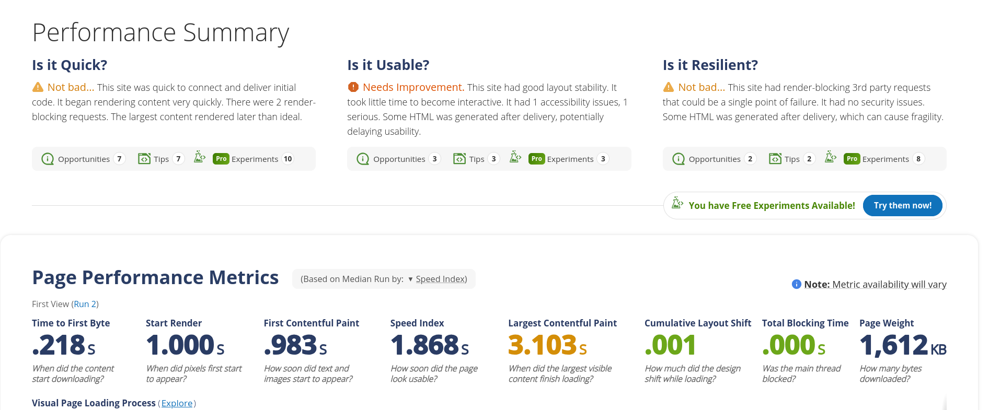
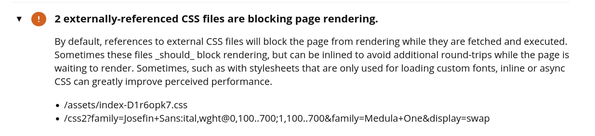
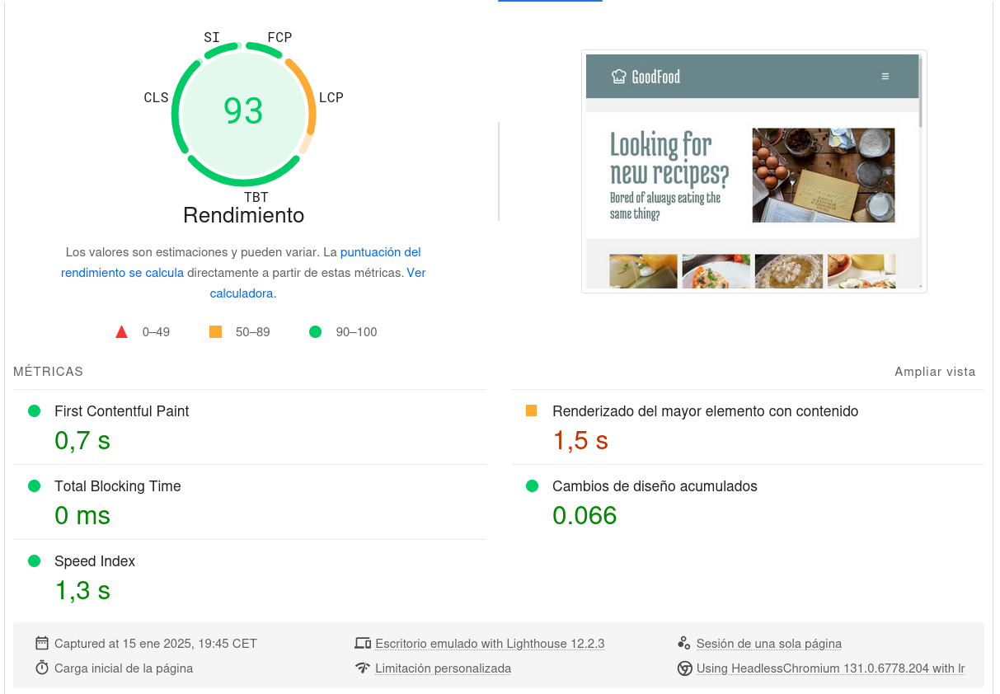
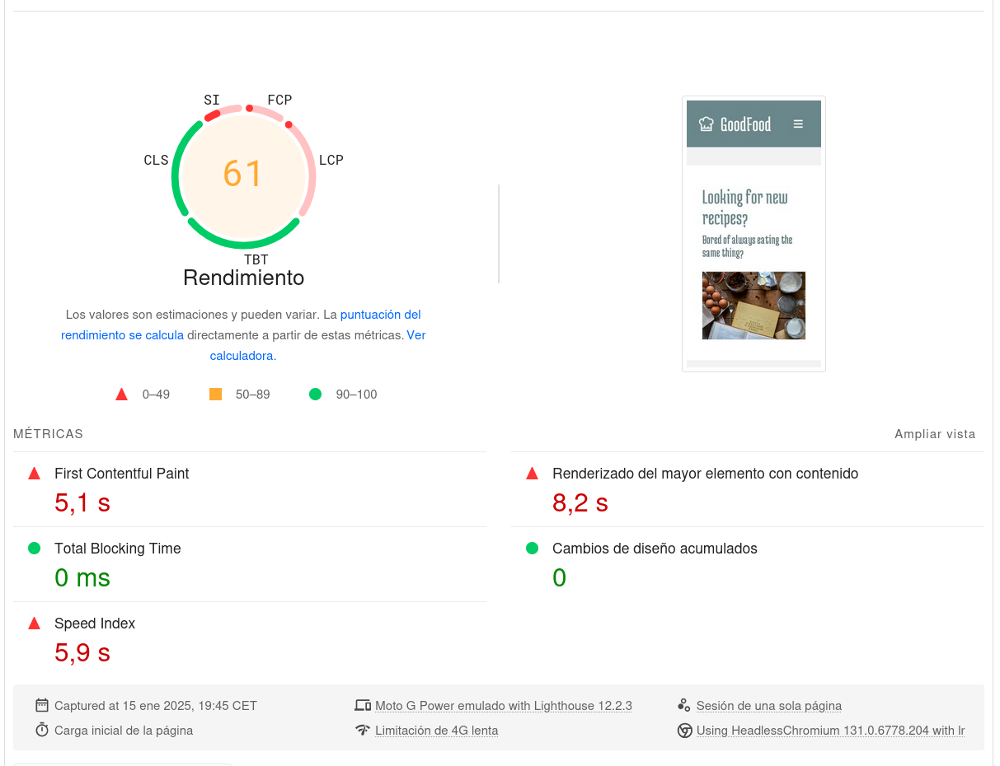
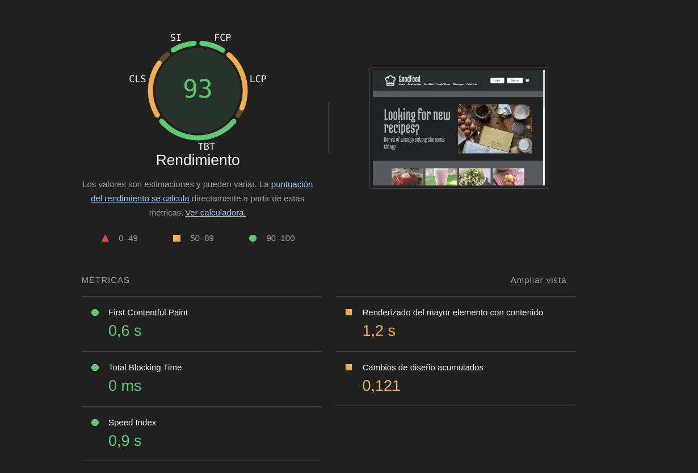
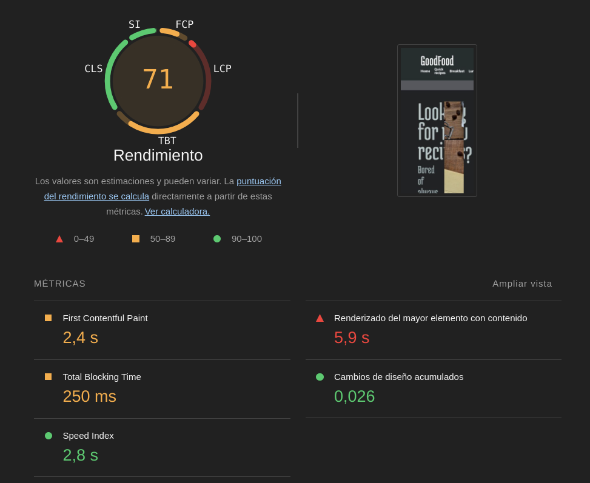
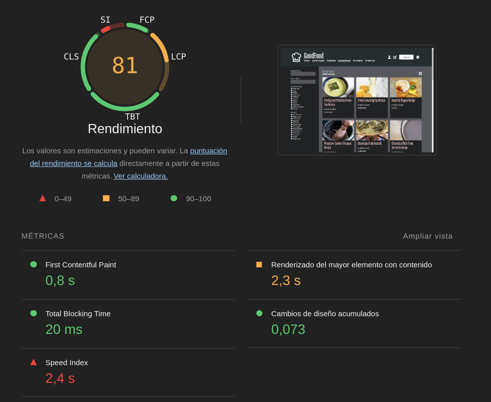
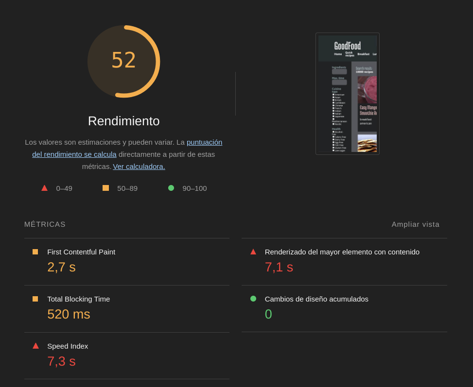
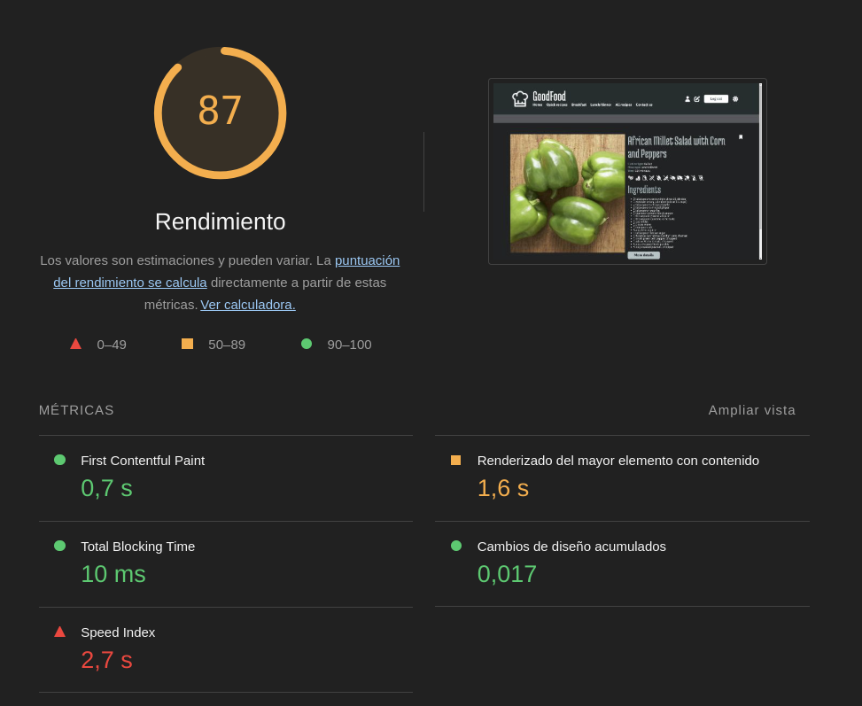
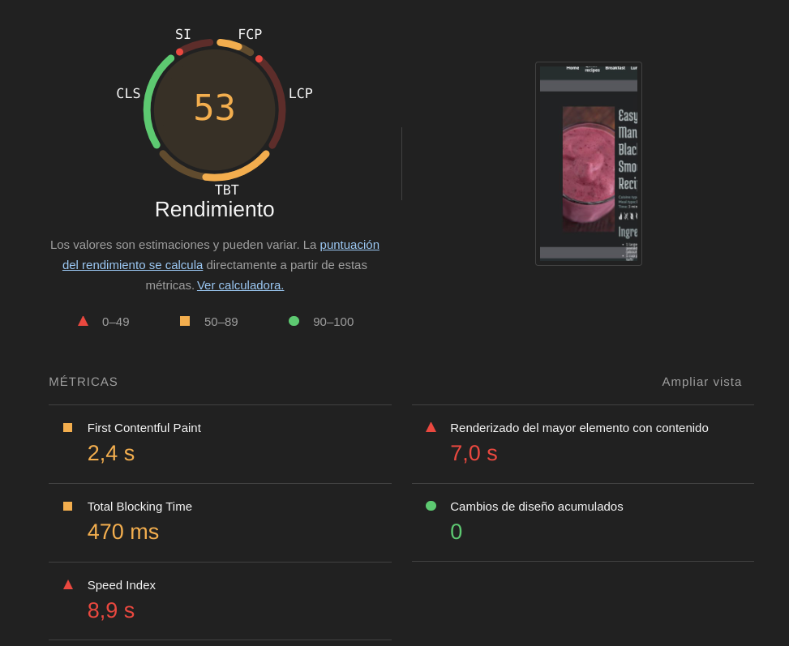

# Testing en producción

# Evaluación inicial de estándares y nagevación

## Estándares empleados

## Facilidad de navegación

# Pruebas de usabilidad y velocidad con herramientas automáticas

## WebPageTest

**Test: Firefox desktop de la página `home`**

Fallos encontrados en la velocidad:
- No se usa el atributo loading="lazy" en las imágenes que devuelve la API.

- Las tipografías están alojadas en servidores de terceros.

Fallos encontrados en la usabilidad:
- Insuficiente contraste entre el color del texto y el color del fondo del footer.

**Test: Edge desktop de la página `home`**

Fallos encontrados en la velocidad:
- La carga de dos CSS externos bloquean la visualización de la página.

- El tiempo que tarda en renderizarse el elemento más grande visible, que es este caso es la imagen de portada

- No se usa el atributo loading="lazy" en las imágenes que devuelve la API.
  
- Las tipografías están alojadas en servidores de terceros.
  

https://www.webpagetest.org/result/250115_BiDcZV_6N6/2/experiments/#Quick

## PageSpeed Insights
**Página `home` - Ordenador**

**Página `home` - Móvil**

Elementos de mejora y recomendaciones:
- Precargar la imagen (elemento LCP) de la portada y usar un tamaño adecuado para las imágenes.
- Usar formatos como WebP y AVIF que comprimen mejor las imágenes, de esta manera se descargan más rápido y consumen menos datos.
- Hay recursos como las tipografías que bloquean el primer renderizado de la página. Sería mejor mostrar los elementos de JS y CSS críticos y posponer los menos importantes como la tipografía.

## Optimización con Lighthouse
**Página `home` - Ordenador**

**Página `home` - Móvil**

**Página `listado` - Ordenador**

**Página `listado` - Móvil**

**Página `producto` - Ordenador**

**Página `producto` - Móvil**

**Recomendaciones para optimizar las páginas analizadas**:
- **Largest Contentful Paint (LCP)**: 
  - Si se añaden dinámicamente imágenes a la página, una buena práctica es precargarlas.
  - Como el contenido se genera dinámicamente con React, minificar los archivos de JS puede reducir el tamaño de carga.
  - Usar imágenes optimizadas, ya que cargan más rápido y consumen menos.
  - Usar formatos como WebP y AVIF, comprimen mejor las imágenes que los formatos PNG o JPEG, esto hace que se descargen más rápido y consuman menos datos.
  - Posponer la carga de las tipografías para priorizar la carga de elementos críticos.
  - Minificar los recursos de JavaScript
- **Cumulative Layout Shift (CLS)**: para reducir los cambios de diseño:
  - La solicitud de red tardía para cargar las tipografías y el fichero CSS provoca cambios en el diseño que afectan a la carga del header y del footer de la web.
  - Hay elementos multimedia sin tamaño concreto. Especificar un ancho y una altura reduce los cambios de diseño.
- **First Contentful Paint (FCP):** para mejorar el rendimiento se puede:
  - Minifiar los archivos de JavaScript
  - Usar imágenes con formatos de próxima generación como WebP y AVIF
  - Priorizar la carga da los elemenos JavaScript y CSS críticos y posponer los que no son esenciales como la carga de la tipografía.
- **Total Blocking Time (TBT)**:
  - Reducir el uso de código externo
  - Evitar los DOM de gran tamaño, porque aumentan el uso de memoria y generan costosas redistribuciones del diseño.
  - Minimizar el trabajo del hilo principal, por ejemplo reduciendo el tiempo de ejecución de JavaScript

## Evaluación con Ghost Inspector

Enlace al video generado -> (vídeo)[https://github.com/avilrod3004/Proyecto4_GoodFood/blob/main/images/test_produccion/ghost_inspector.mp4]