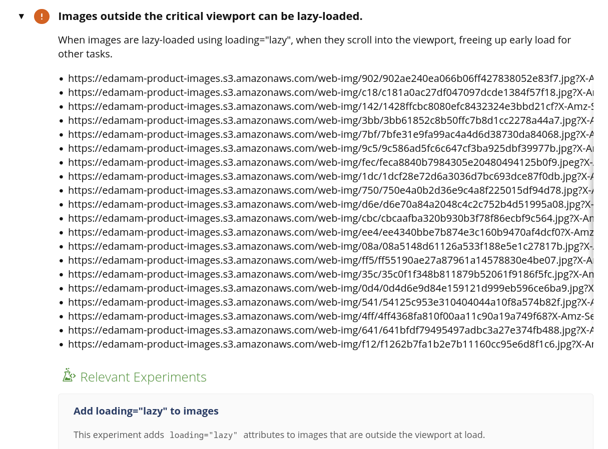

# Testing en producción

# Evaluación inicial de estándares y nagevación

## Estándares empleados

## Facilidad de navegación

# Pruebas de usabilidad y velocidad con herramientas automáticas

## WebPageTest

Fallos encontrados en la velocidad:
- No se usa el atributo loading="lazy" en las imágenes que devuelve la API.

- Las tipografías están alojadas en servidores de terceros.

Fallos encontrados en la usabilidad:
- Insuficiente contraste entre el color del texto y el color del fondo del footer.
