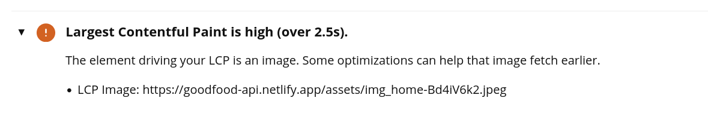

# Testing en producción

# Evaluación inicial de estándares y nagevación

## Estándares empleados

En el desarrollo del proyecto se han aplicado los siguientes estándares:
- **HTML5**: estructuras semánticas, y se han usado atributos como `alt` y `label`
- **CSS3**: se usan unidades relativas en lugar de absolutas y se sigue la metodología BEM
- **JavaScript (ES6)**: el código es compatible con los navegadores principales.
- **Imágenes:** muchas siguen la buena práctica de estar en `png` y `svg`, aunque hay algunas en `jpeg`.

Estándares que no se han aplicado y no cumplen con las pautas de usabilidad:
- En el `footer` el contraste entre el color del texto y el fondo no es suficiente.
- La navegación sin teclado en algunas páginas no es completa.
- En algunos casos las descripciones de las imágenes podrían ser más descriptivas.

## Facilidad de navegación

La web es fácil de navegar con ratón y pantalla táctil (a excepción de algunos errores de responsive).
En cambio, con el teclado en algunas páginas no es posible recorrerlas al completo:
- El `header` y el `footer` son navegables completamente con el tabulador.
- La página del formulario de contacto, login, registro y el formulario para editar los datos del usuario son navegables con el teclado.
- Pero las páginas `home`, el perfil del usuario y las páginas para buscar recetas no son navegables completamente. No es posible navegar sobre las tarjetas de las recetas con el tabulador.

## Reflexión

Gracias a los estándares podemos crear una experiencia de usuario lógica y accesible, al seguir estas normas nos aseguramos que nuestra página sea atractiva, funcional y entendible para cualquier usuario.

# Pruebas de usabilidad y velocidad con herramientas automáticas

## WebPageTest

**Test: Firefox desktop de la página `home`**

Fallos encontrados en la velocidad:
- No se usa el atributo loading="lazy" en las imágenes que devuelve la API.

- Las tipografías están alojadas en servidores de terceros.

Fallos encontrados en la usabilidad:
- Insuficiente contraste entre el color del texto y el color del fondo del footer.

**Test: Edge desktop de la página `home`**

Fallos encontrados en la velocidad:
- La carga de dos CSS externos bloquean la visualización de la página.

- El tiempo que tarda en renderizarse el elemento más grande visible, en este caso es la imagen de portada

- No se usa el atributo loading="lazy" en las imágenes que devuelve la API.
  
- Las tipografías están alojadas en servidores de terceros.
  
- El tamaño del HTML (DOM) final es mucho mayor que el inicial. En este caso porque el contenido es generado por React.
  

Fallos encontrados en la usabilidad:
- Hay imágenes que el navegador no tiene forma de saber su alto y ancho. Esto puede hacer que el contenido se desplace mientras se cargan las imágenes.
  
- El constraste entre el color del texto y el color del fondo del footer es insuficiente

**Test: Chrome móvil de la página `home`**

Fallos encontrados en la velocidad:
- La carga de dos CSS externos bloquean la visualización de la página

- El tiempo de carga del LCP es alto. En este caso el elemento es el título de la web.

- No se usa el atributo loagind="lazy" en las imágenes que devuelve la API

- Las tipografías están alojadas en servidores de terceros

- El tamaño final del DOm es mucho mayor que el HTML inicial, debido a que el contenido es generado por React

Fallos encontrados de usabilidad:
- Hay dos imágenes sin medidas de alto y ancho establecidas. El contenido puede desplazarse al cargar las imágenes

- El hilo principal fue bloqueado por 618 ms. Esto hace que los usuarios no puedan interactuar con el contenido de la página.

- El contraste entre el color del texto del footer y el color del fondo dificultan la accesiblidad.

- El tamaño final del DOm es mucho mayor que el HTML inicial, debido a que el contenido es generado por React
  

## PageSpeed Insights
**Página `home` - Ordenador**

**Página `home` - Móvil**

Elementos de mejora y recomendaciones:
- Precargar la imagen (elemento LCP) de la portada y usar un tamaño adecuado para las imágenes.
- Usar formatos como WebP y AVIF que comprimen mejor las imágenes, de esta manera se descargan más rápido y consumen menos datos.
- Hay recursos como las tipografías que bloquean el primer renderizado de la página. Sería mejor mostrar los elementos de JS y CSS críticos y posponer los menos importantes como la tipografía.

## Optimización con Lighthouse
**Página `home` - Ordenador**

**Página `home` - Móvil**

**Página `listado` - Ordenador**

**Página `listado` - Móvil**

**Página `producto` - Ordenador**

**Página `producto` - Móvil**

**Recomendaciones para optimizar las páginas analizadas**:
- **Largest Contentful Paint (LCP)**: 
  - Si se añaden dinámicamente imágenes a la página, una buena práctica es precargarlas.
  - Como el contenido se genera dinámicamente con React, minificar los archivos de JS puede reducir el tamaño de carga.
  - Usar imágenes optimizadas, ya que cargan más rápido y consumen menos.
  - Usar formatos como WebP y AVIF, comprimen mejor las imágenes que los formatos PNG o JPEG, esto hace que se descargen más rápido y consuman menos datos.
  - Posponer la carga de las tipografías para priorizar la carga de elementos críticos.
  - Minificar los recursos de JavaScript
- **Cumulative Layout Shift (CLS)**: para reducir los cambios de diseño:
  - La solicitud de red tardía para cargar las tipografías y el fichero CSS provoca cambios en el diseño que afectan a la carga del header y del footer de la web.
  - Hay elementos multimedia sin tamaño concreto. Especificar un ancho y una altura reduce los cambios de diseño.
- **First Contentful Paint (FCP):** para mejorar el rendimiento se puede:
  - Minifiar los archivos de JavaScript
  - Usar imágenes con formatos de próxima generación como WebP y AVIF
  - Priorizar la carga da los elemenos JavaScript y CSS críticos y posponer los que no son esenciales como la carga de la tipografía.
- **Total Blocking Time (TBT)**:
  - Reducir el uso de código externo
  - Evitar los DOM de gran tamaño, porque aumentan el uso de memoria y generan costosas redistribuciones del diseño.
  - Minimizar el trabajo del hilo principal, por ejemplo reduciendo el tiempo de ejecución de JavaScript

## Evaluación con Ghost Inspector

Enlace al video generado -> [vídeo](https://github.com/avilrod3004/Proyecto4_GoodFood/blob/main/images/test_produccion/ghost_inspector.mp4)

El test automático es completado con éxito:
- Inicia sesión en la cuenta del usuario
- Busca recetas
- Consulta los datos de varias recetas y las añade a favoritos
- Visita su perfil de usuario y elimina una receta de favoritos.

El test se ejecuta en un tamaño de pantalla menor a la mia, por lo que las opciones del header están ocultas para que sea responsive. El test se ejecuta como si las opciones fueran visibles.

# Reflexión final
El sitio web cumple con muchos de los estándares y es navegable, pero hay varios aspectos necesarios para mejorar la usabilidad y la navegación.

Cambios:
- Completar la navegación por teclado
- Corregir el contraste entre el texto y el fondo del `footer`
- Definir el alto y ancho de las imágenes
- Usar loading="lazy" en las imágenes que devuelve la API
- Priorizar la carga de los elementos críticos
- Minificar los archivos JavaScript para reducir el tiempo de carga del hilo principal.
- Terminar el responsive.